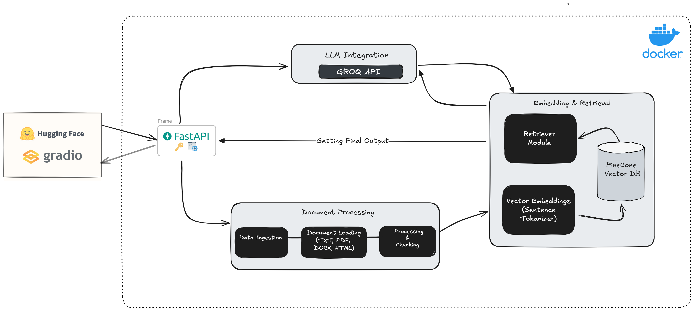

Below is an example of a polished, informative, and professional README for your project. You can copy the content into your README.md file and adjust details as needed.

---

# RAG AI App

[](LICENSE)
[](https://github.com/yourusername/yourrepo/actions)
[](https://huggingface.co/spaces/Tsk001/RAG_Gradio_App)

## Overview

The **RAG AI Project** is a comprehensive system that demonstrates retrieval-augmented generation (RAG) by combining state-of-the-art NLP techniques, document processing, vector database management, and LLM integration. This project integrates a FastAPI backend with a user-friendly Gradio UI, enabling seamless document ingestion, semantic search, and context-aware response generation.

## Architecture


The overall architecture of the project is designed to handle the entire data flow—from document ingestion to response generation. The key components include:

- **Gradio UI (Frontend):**  
  Provides an interactive interface for uploading documents, querying the system, and visualizing responses.  
  *(Hosted on Hugging Face Spaces)*

- **FastAPI Backend (API Layer):**  
  Exposes RESTful endpoints that handle document processing, query routing, and integration with the LLM.

- **Document Ingestion & Preprocessing:**  
  Processes multiple file formats (TXT, PDF, DOCX, HTML) and cleans the data for further processing.

- **Embedding Generation & Semantic Search:**  
  Uses Sentence Transformers to generate document embeddings and stores them in Pinecone for efficient vector search.

- **LLM Integration:**  
  Utilizes the Groq API to integrate with a language model (e.g., LLaMA 3.3 70B) for generating context-aware responses.

- **Deployment & DevOps:**  
  Containerized using Docker with CI/CD integration via GitHub Actions and deployed on Hugging Face Spaces.
  
## Features

- **End-to-End RAG Pipeline:**  
  Seamlessly integrates document ingestion, vector embedding, semantic search, and LLM-based response generation.

- **Multi-Format Document Support:**  
  Processes TXT, PDF, DOCX, and HTML files using custom loaders and preprocessors.

- **Semantic Search:**  
  Leverages Pinecone to efficiently index and retrieve document embeddings based on query similarity.

- **Interactive User Interface:**  
  Built with Gradio, providing an easy-to-use, real-time chat interface and advanced settings for fine-tuning LLM parameters.

- **Robust API Backend:**  
  FastAPI provides a scalable RESTful API to handle client requests and internal processing.

- **Containerized & CI/CD-Enabled:**  
  Uses Docker for containerization and GitHub Actions for automated testing and deployment.

- **Hosted on Hugging Face Spaces:**  
  Accessible online for demo and evaluation: [RAG Gradio App on Hugging Face Spaces](https://huggingface.co/spaces/Tsk001/RAG_Gradio_App)

## Installation & Setup

### Prerequisites

- **Python 3.10**
- **pip**
- **Docker** (optional, for containerized deployment)
- **Git**

### Clone the Repository

```bash
git clone https://github.com/tanmaysk001/My-RAG-App.git
cd My-RAG-App
```

### Create a Virtual Environment (Optional but Recommended)

```bash
python3 -m venv venv
source venv/bin/activate   # On Windows use: venv\Scripts\activate
```

### Install Dependencies

```bash
pip install --upgrade pip
pip install -r requirements.txt
```

### Configure Environment Variables

For local development, create a `secrets.env` file in the repository root (or set the environment variables manually):

```dotenv
PINECONE_API_KEY=your_pinecone_api_key_here
LLM_API_KEY=your_llm_api_key_here
ENV=prod
```

> **Note:** The secret-loading helper in `src/utils/helpers.py` first checks for environment variables—perfect for deploying on Hugging Face Spaces.

## Running the Application Locally

The project combines the FastAPI backend and the Gradio frontend into a single application using threading. To start the application, run:

```bash
python app.py
```

- The FastAPI backend runs on `http://127.0.0.1:8080` (internally).
- The Gradio UI is served on `http://127.0.0.1:7860`.

## Deployment on Hugging Face Spaces

1. **Push Your Code to GitHub:**  
   Ensure your repository is updated with the latest changes.

2. **Configure Secrets on Hugging Face Spaces:**  
   In your Space’s **Settings → Secrets and variables**, add:
   - `PINECONE_API_KEY`
   - `LLM_API_KEY`
   - (Optional) `ENV`

3. **Link Your Repository to a New Space:**  
   Create a new Hugging Face Space and link it to your repository. The app’s entry point (`app.py`) will be used automatically.

4. **Access the Live Demo:**  
   Once deployed, your app will be available online at Huggingface spaces
   
## Technologies & Tools

- **Backend:** Python 3.12, FastAPI, Uvicorn
- **Frontend:** Gradio
- **Machine Learning:** Sentence Transformers, Groq API (LLaMA integration)
- **Vector Database:** Pinecone
- **Deployment & CI/CD:** Docker, GitHub Actions, Hugging Face Spaces
- **Document Processing:** Custom loaders for TXT, PDF, DOCX, HTML
- **Version Control:** Git & GitHub

## Contributing

Contributions are welcome! Please fork the repository and submit pull requests. For major changes, please open an issue first to discuss what you would like to change.

## License

This project is licensed under the MIT License. See the [LICENSE](LICENSE) file for details.

---

Feel free to adjust and expand this README as your project evolves. Happy coding!
